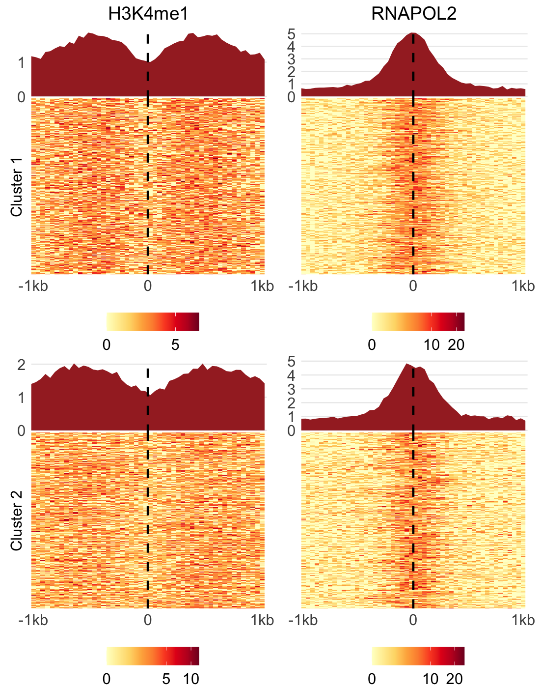
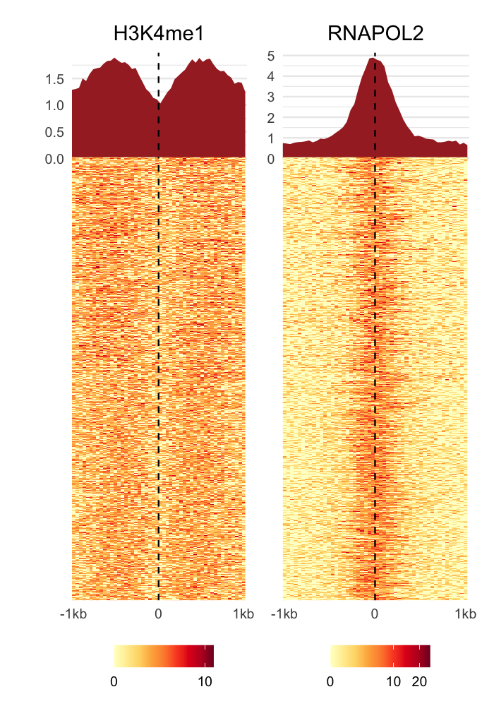
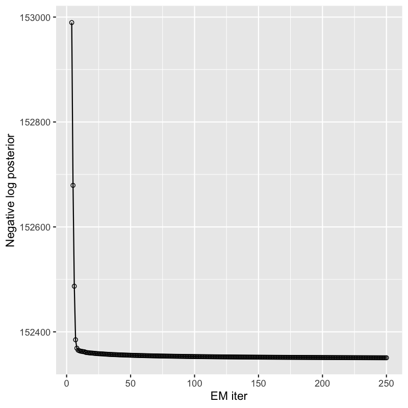
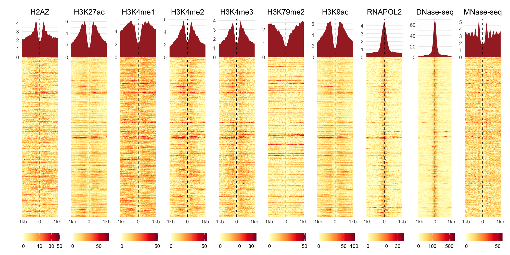

# ChromDMM

This R package contains ChromDMM, a Dirichlet-multinomial mixture model for clustering heterogeneous epigenetic data

## Installation

You can install the ChromDMM R package using [devtools](https://devtools.r-lib.org):

```R
devtools::install_github('MariaOsmala/ChromDMM')
```
ChromDMM depends on the following R-packages, which should be installed automatically when you install the `ChromDMM` package:

- [Rcpp](https://cran.r-project.org/web/packages/Rcpp/index.html)
- [ggplot2](https://cran.r-project.org/web/packages/ggplot2/index.html)
- [reshape2](https://cran.r-project.org/web/packages/reshape2/index.html)
- [GGally](https://cran.r-project.org/web/packages/GGally/index.html)
- [plyr](https://cran.r-project.org/web/packages/plyr/index.html)
- [S4vectors](https://bioconductor.org/packages/release/bioc/html/S4Vectors.html)
- [IRanges](https://bioconductor.org/packages/release/bioc/html/IRanges.html)
- [e1071](https://cran.r-project.org/web/packages/e1071/index.html)
- [RcppArmadillo](https://cran.r-project.org/web/packages/RcppArmadillo/index.html)
- [RcppGSL](https://cran.r-project.org/web/packages/RcppGSL/index.html)
   
## Running ChromDMM analysis

The scripts to reproduce a part of the results as described in the paper, are in the `ChromDMM/scripts` folder.

Running the analysis depends on more software than just the ChromDMM package.
To install the required software, R and possible c/c++ compilers, we recommend using [anaconda](https://www.anaconda.com/products/individual) and the provided `conda_environment_linux.yml`
or `conda_environment_mac.yml` file:

```
conda env create -f ChromDMM/conda_environment.yml -n ChromDMM
source activate ChromDMM
```

The script `ChromDMM/scripts/run_ChromDMM.R` performs the analysis.

### Simulated data clustering
The file`experiment_data/data.RDS` is an example of shifted and flipped simulated data that contains two chromatin features H3K4me1 and RNAPOL2 and two clusters. It is a list containing the following elements:

* data: List of two matrices named H3K4me1 and RNAPOL2 of size N=1000 x L=50, where N is the number of
genomic elements (e.g. enhancers) and L is the length of chromatin feature profiles/coverage counts. The coverage counts are originally extracted in genomic windows of size W=2000. Resolution B=40 results in profiles of length 50.
* labels: Vector of length N. True cluster labels (1 or 2). THe first 500 regions belong to cluster 1 and the rest belong to cluster 2.
* true.flips: Vector of length N, true flip states (1 or 2)
* true.shift.ind : Vector of length N, true flip state, value in range [1:21], S=21 is the number of possible shift states
* true.shift.bases: Vector of length N, true shifts in base pairs, values in range [-400, 400] and multiplication of 40
* tobe.unshifted.unflipped.data: List of 2 matrices names H3K4me1 and RNAPOL2 of size N=1000 x L=70. This data is used to realign the profiles according to the learned shift states. The coverage counts are originally extracted in genomic windows of size 2800. Resolution B=70 results in profiles of length 70

Visualise the simulated data

```
bin_size=40
data="experiment_data/data.RDS"

Rscript scripts/plot_data.R  --data $data --bin.size $bin_size --name "shifted-flipped-data" 

```

{ width=40% }

Visualisation if the clustering is not known

```
bin_size=40
data="experiment_data/data.RDS"

Rscript scripts/plot_data_without_clusters.R  --data $data --bin.size $bin_size --name "shifted-flipped-data" 

```
{ width=40% }

The analysis is run as follows. The analysis can be run in parallel with 15 cpus, as the cluster number is varied from 1 to 3, and for each cluster number 5 repetitions are performed, each with random initialisation point. The best model fit of the
repetitions is retained. If parallel=TRUE, verbose should be set of FALSE. The analysis takes x hours/mins with 12 cpus, memory X/cpu.
```
bin_size=1
data="experiment_data/data.RDS"

Rscript scripts/run_ChromDMM.R  --data $data --cluster 1,2,3 --bin.size $bin_size --verbose FALSE --shift 21 --flip TRUE --seed.boolean FALSE --repetition 10 --parallel TRUE --output "experiment_data/simulated_data_fit.RDS" 
```

AIC and BIC values for varying number of clusters. 

```
fit="experiment_data/simulated_data_fit_mac.RDS"
name="simulated_data"

Rscript scripts/AICBIC.R  --fit $fit --name $name 

```

<p float="left">
  
   
  </p>

Choose 2 for the number of clusters. Plot the negative log posterior as the function of EM iterations to check the convergence

```
fit="experiment_data/simulated_data_fit_mac.RDS"
name="simulated_data"
Rscript scripts/simulated_figures.R  --fit $fit --cluster 2 --skip 1 --name $name 

```
{ width=40% }

`simulated_figures.R` also plots EM convergence diagnostics, see `figures/EM-diagnostics-simulated_data.png`


### Enhancer ENCODE data clustering

The object in file file `experiment_data/1000_enhancers_4modifications.Rds`
is a list of 3 elements:

* data is a list of 4. Each list element contains N x W chromatin feature data matrices. N is the number of elements and W is the genomic window. The chromatin features are H3K27ac, H3K4me1, RNA POL II, and MNase-seq. This data is given to the ChromDMM
* binned.data: same as data, but created with resolution B=40
* tobe.unshifted.unflipped.binned.data: List of 10 matrixes of size N x W. Data extracted originally in window W=2800 and binned with B=40.

The analysis is run as follows. The analysis can be run in parallel with 24 cpus, as the cluster number is varied from 3 to 8, and for each cluster number 5 repetitions are performed, each with random initialisation point. The best model fit of the
repetitions is retained. If parallel=TRUE, verbose should be set of FALSE. The analysis takes x hours/mins with 24 cpus, memory X/cpu.

Visualisation of the data

```
bin_size=40
data="experiment_data/1000_enhancers_4modifications.RDS"

Rscript scripts/plot_data_without_clusters.R  --data $data --bin.size $bin_size --bin.data TRUE --name "enhancers_4mods" --fig.width 1000 --fig.height 1000

```
{ width=40% }


```
data="experiment_data/1000_enhancers_4modifications.Rds"
bin_size=40
window=2000

Rscript scripts/run_ChromDMM.R  --data $data --cluster 2,3,4,5,6,7,8 --bin.size $bin_size --window $window --verbose FALSE --shift 21 --flip TRUE --seed.boolean FALSE --repetition 5 --parallel TRUE --output "data_experiments/4mods_fit.RDS"
```

The object in file file `experiment_data/1000_enhancers_10modifications.Rds`
is a list of 3 elements:

* data is a list of 10. Each list element contains N x W chromatin feature data matrices. N is the number of elements and W is the genomic window. The chromatin features are H2AZ, H3K27ac, H3K4me1, H3K4me2, H3K4me3, H3K79me2, H3K9ac, 
RNAPOL2, DNase-seq and MNase-seq. This data is given to the ChromDMM
* binned.data: same as data, but created with resolution B=40
* tobe.unshifted.unflipped.binned.data: List of 10 matrixes of size N x W. Data extracted originally in window W=2800 and binned with B=40.

The analysis is run as follows. The analysis can be run in parallel with 24 cpus, as the cluster number is varied from 3 to 8, and for each cluster number 5 repetitions are performed, each with random initialisation point. The best model fit of the
repetitions is retained. If parallel=TRUE, verbose should be set of FALSE. The analysis takes x hours/mins with 24 cpus, memory X/cpu.

Visualisation of the data

```
bin_size=40
data="experiment_data/1000_enhancers_10modifications.RDS"

Rscript scripts/plot_data_without_clusters.R  --data $data --bin.size $bin_size --bin.data TRUE --name "enhancers_10mods" --fig.width 2000 --fig.height 1000

```
{ width=100% }


```
data="experiment_data/1000_enhancers_4modifications.Rds"
bin_size=40
window=2000

Rscript scripts/run_ChromDMM.R  --data $data --cluster 2,3,4,5,6,7,8 --bin.size $bin_size --window $window --verbose FALSE --shift 21 --flip TRUE --seed.boolean FALSE --repetition 5 --parallel TRUE --output "data_experiments/10mods_fit.RDS"
```

## Citation

Osmala, M., Eraslan, G. & Lähdesmäki, H. (2022). ChromDMM: A Dirichlet-Multinomial Mixture Model For Clustering Heterogeneous Epigenetic Data (submitted.)

## License

This project is licensed under the LGPL-3 License - see the [LICENSE.md](LICENSE.md) file for details

## Contact

Maria Osmala, MSc  
PhD student  
Aalto University School of Science  
Department of Computer Science  
Email: firstname.surname@aalto.fi  
Home Page: https://people.aalto.fi/maria.osmala

Gökcen Eraslan, PhD
Postdoctoral Researcher
Broad Institute of MIT and Harvard
Email: gokcen.eraslan@gmail.com
Home Page: http://linkedin.com/in/gokcen

Harri Lähdesmäki, D. Sc. (Tech)  
Associate Professor  
Aalto University School of Science  
Department of Computer Science  
Email: firstname.surname@aalto.fi  
Home Page: http://users.ics.aalto.fi/harrila

## Acknowledgments

The ChromDMM package is an extension of bioconductor package [DirichletMultinomial](https://bioconductor.org/packages/release/bioc/html/DirichletMultinomial.html): Dirichlet-Multinomial Mixture Model Machine Learning for Microbiome Data by Martin Morgan. DirichletMultinomial is an interface to [code](https://code.google.com/archive/p/microbedmm/) originally made available by [Holmes,Harris, and Quince, 2012, PLoS ONE 7(2): 1-15.](https://pubmed.ncbi.nlm.nih.gov/22319561/)
